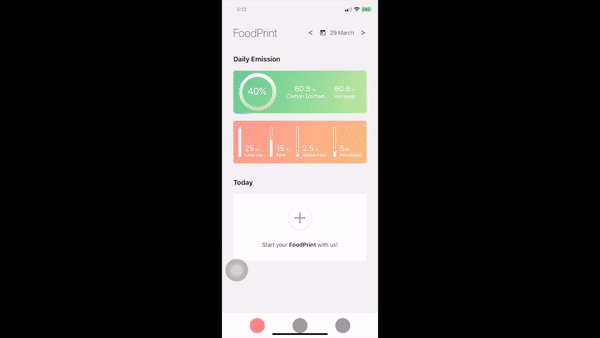

# Carbon Foodprint

This is a prototype I built for NYU hackathon 2020, using Expo react-native.

### Overview

  This app is a carbon food diary that documents how much carbon are emitted based on the food you consumed every day. 
  
  For each meal, uers can either take or upload a photo of the food they eat. 
  The app will analyze the different kinds of food in the photo and calculate how many carbon emissions and what the sources of carbon emissions are in those food. 
    
  The home page shows your daily carbon emission so far, how much you've improved compared to the yesterday's data, and 
  the visualization of your carbon emission into four categories.
 
### Demo

### Potential Improvements

* integrate with a real database
* integrate with a photo recognition api that analyze the food in the photo
* find a database that contains carbon emission of each kind of food
